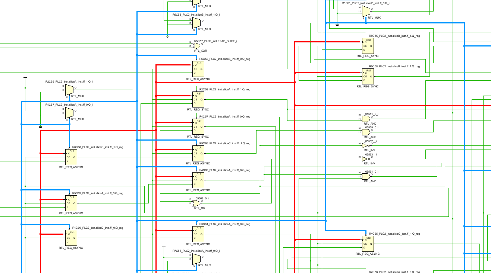
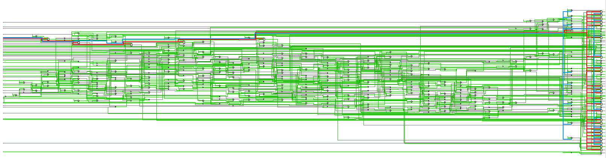
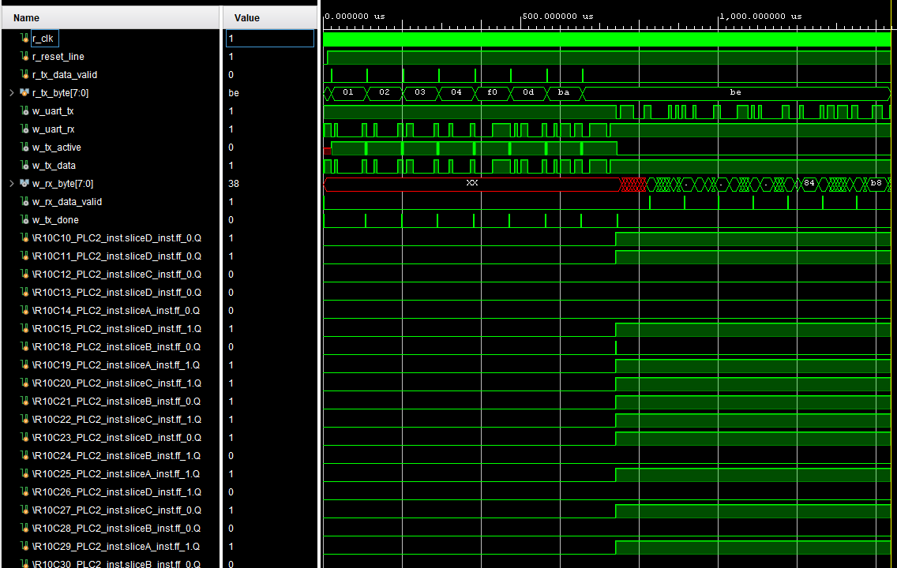
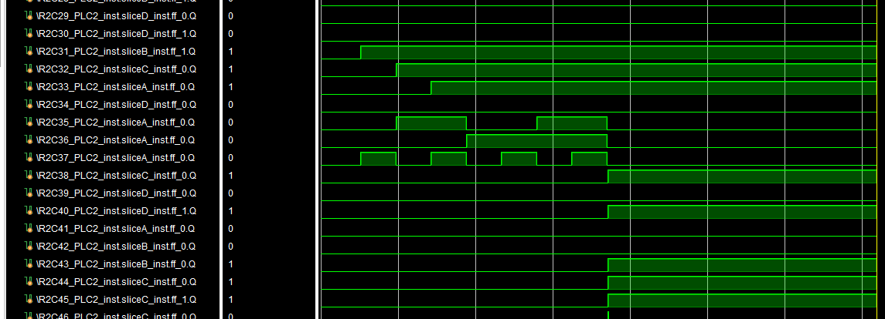
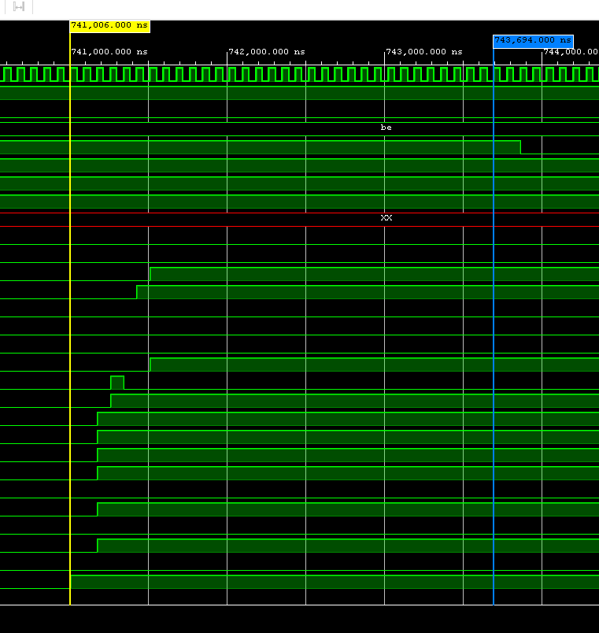
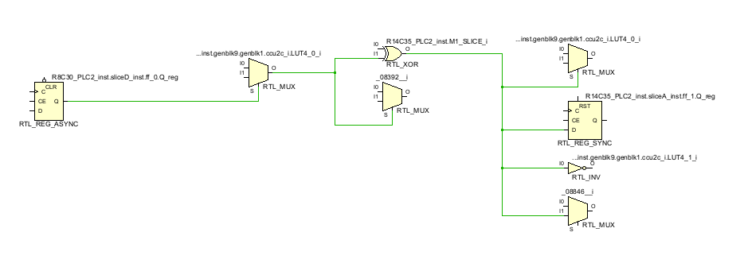
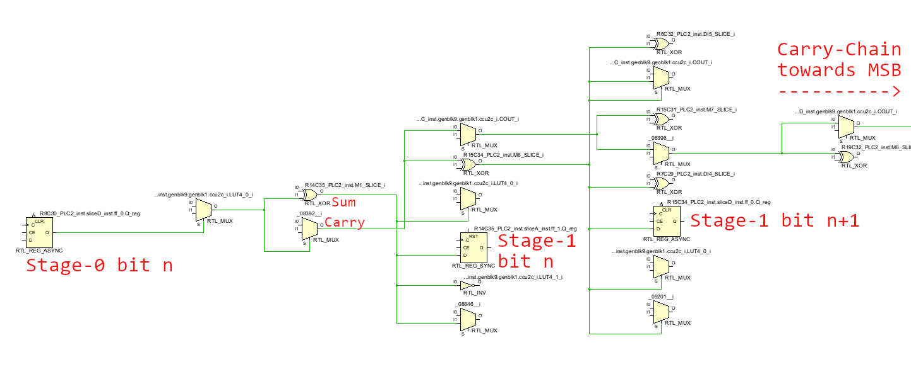

Revenge of LLLattice
====================

*A Tale of Block-Ciphers and Carry-Chains*

by Johannes Berndorfer (@berndoJ) and Jonas Konrad (@jalaka)
Team @CyberSecurityAustria

## Overview

*Revenge of LLLattice* was a hardware challenge at the pbctf 2023. It is in type
similar to the pbctf 2021 challenge *LLLattice*, as the name already suggests.

Effectively, this challenge is a combination of hardware reversing and basic
crypto.


## Prompt

Author: VoidMercy

```
It's back from pbCTF 2021! Again, there is a 115200 baud UART server running on
the FPGA with a 12 MHz clock, but it seems to be sending back garbage data in
response. Can you reverse engineer the intercepted message?
```

Attachments: challenge.bit, flag.enc


## TL;DR

As no team solved this challenge during the CTF, we decided to create a detailed
writeup. For those who just want to know the overall steps - here's a TL;DR:

- Identify the FPGA bitstream part from `xxd` and google to find out it's a
  lattice FPGA.
- Use `ecpunpack` ([Project Trellis](https://github.com/YosysHQ/prjtrellis)) and
  VoidMercy's [Lattice ECP5 Bitstream Decompiler](https://github.com/VoidMercy/Lattice-ECP5-Bitstream-Decompiler)
  to "decompile" the bitstream into Verilog.
- Use `yosys` to simplify and clean up the Verilog file, reduces line count from
  over 650K to ~60K.
- Get a RTL schematic using a toolchain like Vivado to find out what the inputs
  and outputs of the FPGA are used for (UART TX/RX, reset, clock).
- Code a testbench in Verilog to be able to communicate with the FPGA over
  UART and send/receive data -> it encrypts 8-byte blocks and sends them back
  over UART. Through changing the input we give to the FPGA we can also find out
  that the encryption method used is a ECB block cipher.
- Use a timeline analysis tool (Vivado or iverilog with GTKWave) to find out that
  the encryption happens over 32 clock cyles -> the block cipher most likely has
  32 rounds. 64-bit, 32 rounds -> this could be TEA!
- Use the RTL-schematic and statistical analysis (or other methods) to find out
  which FFs correspond to which bit in which encryption round (only first two
  rounds needed). By statical analysis on the schematic we can also further
  confirm our guess that the algo used is TEA because we find two 32-bit adders
  between each encryption stage.
- Extract the two 32-bit data words for two consecutive TEA rounds and use
  bruteforce to find out the encryption keys -> `b'bocchi za rock!\x00'`
- Decrypt the `flag.enc` file with this key and obtain the flag:
  `pbctf{amazing job! now go enjoy an after school tea time break!}`


## Process

First, we inspected the files we were given in order to determine how we could
reverse them. Using `file` we just see that both identify as `data`, so nothing
useful here. Howevery, by using `xxd` to hexdump the head of the `challenge.bit`
file we can extract a part number: `LFE5U-25F-6CABGA381`

```
$ xxd challenge.bit | head
00000000: ff00 5061 7274 3a20 4c46 4535 552d 3235  ..Part: LFE5U-25
00000010: 462d 3643 4142 4741 3338 3100 ffff ffbd  F-6CABGA381.....
00000020: b3ff ffff ff3b 0000 00e2 0000 0041 1110  .....;.......A..
00000030: 4322 0000 0040 0000 0046 0000 0082 911d  C"...@...F......
00000040: 8a00 0000 0000 0000 0000 0000 0000 0000  ................
...
```

This PN corresponds to an FPGA part from Lattice, so `challenge.bit` is a
bitstream file for this part.

`flag.enc` only contains 64-bytes of seemingly random/encrypted data:

```
$ xxd flag.enc            
00000000: fdf6 ecfb 4d87 5d41 cf5f cc44 00c0 dda4  ....M.]A._.D....
00000010: 9c2c 8dc2 cb66 bcd8 23e9 b94c 00ca e858  .,...f..#..L...X
00000020: 734f be44 2e96 32f7 7c04 7ffa 436f caf7  sO.D..2.|...Co..
00000030: c6a2 35ee 23b1 f76c 45f3 6313 a1a9 22d4  ..5.#..lE.c...".
```

### Decompiling the Bitstream

The bitstream contains all config data needed to represent the design that is
loaded into the FPGA. However, we need some kind of readable/simulatable format
in order to reverse the logic contained within it.

For this, we first use `ecpunpack`, a tool from [Project Trellis](https://github.com/YosysHQ/prjtrellis),
to convert the bistream into an ASCII format:

```
$ ecpunpack challenge.bit challenge.tcf
```

Next, we can use VoidMercy's [Lattice ECP5 Bitstream Decompiler](https://github.com/VoidMercy/Lattice-ECP5-Bitstream-Decompiler)
to "decompile" our TCF file into Verilog. This translation directly maps the
netlist described within the TCF file into a logically equivalent Verilog file
based upon implementations of the FPGA cells/slices.

As this file is huge (~55MB), it is still not in a useful form to analyze and
simulate. To simplify the described logic, we use the following [yosys](https://github.com/YosysHQ/yosys)
script:

```
read_verilog challenge_decompiled.v
hierarchy -top top
synth
flatten
opt
clean
opt_clean -purge
write_verilog -noattr challenge_opt.v
```

### Simulation

In order to dynamically assess what the challenge logic does, we need a way of
simulating design. In addition, we also need to be able to interact with the
design in order to send and receive data from the UART interface hinted to by
the prompt.

In the top module definition of the optimized Verilog file, we see that there
are four signals we need to consider:

```verilog
module top (
    output MIB_R0C40_PIOT0_JTXDATA0A_SIOLOGIC,
    input MIB_R0C40_PIOT0_JPADDIB_PIO,
    input G_HPBX0000,
    input MIB_R0C60_PIOT0_JPADDIA_PIO
);
```

To find out which signal corresponds to which function, we can open the Verilog
file in a toolchain like Xilinx Vivado in order to get a RTL schematic. By
highlighting the signals in question, we can see where they are connected. The
following image shows `G_HPBX0000` highlighted in red and `MIB_R0C60_PIOT0_JPADDIA_PIO`
in blue within the RTL-schematic viewer of Vivado.



We can observe, that `G_HPBX0000` is connected to the clock inputs of most, if
not all, flip-flops, so this is probalbly our main clock input. Similarly,
the `MIB_R0C60_PIOT0_JPADDIA_PIO` seems to connect to reset pins / logic, so
this is most likely a reset signal.

As UART requires a TX (output) and RX (input) signal, we can now finally
map the signals as follows:

| Signal Name                          | Signal Function             |
|--------------------------------------|-----------------------------|
| `G_HPBX0000`                         | Main Clock (12 MHz)         |
| `MIB_R0C60_PIOT0_JPADDIA_PIO`        | System Reset                |
| `MIB_R0C40_PIOT0_JPADDIB_PIO`        | UART RX (Testbench -> FPGA) |
| `MIB_R0C40_PIOT0_JTXDATA0A_SIOLOGIC` | UART TX (FPGA -> Testbench) |

Based on our findings, we can now write a small testbench in Verilog that
implements a UART transmitter and receiver in order to communicate with the
design. [testbench.v](./files/verilog/testbench.v) takes space-separated hex
values piped into it via `stdin`, sends them to the FPGA, waits for a response
and prints them to the terminal.

To simulate the design, we used [iverilog](http://iverilog.icarus.com/).

```
$ iverilog -o chall_tb -v testbench.v -s challenge_tb
$ echo "00 01 02 03 04 05 06 07" | vvp ./chall_tb
```

By sending some example values to the FPGA, we can observe, that the FPGA waits
for 8 bytes to be sent, and then responds with a set of different 8 bytes,
most likely encrypted - as the prompt of the challenge already suggests.

We can now try to slightly alter the payload in order to test the behaviour of
the encryption alogrithm. As even a single bit-flip within a block leads to a
completely different ciphertext within this
block, we can infer that the alogrithm must be some kind of *64-bit block cipher*.

Furthermore, by sending the same block twice consecutively, we observe that the
ciphertext block is still the same, so the alogrithm is a *ECB style* cipher.

### Dynamic Analysis

The difficulty with reverse-engineering a relatively large logical circuit as
the one featured within this challenge is the sheer amount of components and
wires. As an example, this is how one page (in total 70 pages) of the RTL
schematic looks like:



So static analysis of the circuit in order to get a big-picture grasp of what 
the FPGA is doing is most likely not a feasible option.

Fortunately, in order to identify signals of interest, we can just simulate the
design and look at the behaviour of internal flip-flop states. The [testbench.v](./files/verilog/testbench.v)
file already spits out a dump file (called `dump.vcd`) which we can view with
[GTKWave](https://gtkwave.sourceforge.net/), or we can just simulate the
testbench within a toolchain like Vivado.



As we can see, most of the simulation time is spent during the TX/RX phases of
the UART communication. All the signals with the long names are internal
FF (flip-flop) signals - we see that most acitivity is happening between the
transmissions. This makes sense, as the FPGA can only start to encrypt after
having recieved the last byte of the block.

In addition, we can also see some signals that are related to the UART logic:



By observing the signals that change during the encryption phase closely, we can
see that they all change within a timeframe of 32 clock cycles, as shown
in the following image (there are a few thousand signals, so the shown ones
are only as an example.):



As the total design roughly features a bit more than 32 * 64 FFs, we can infer
that the block cipher used must be using 32 rounds, each round being computed in
a single clock cycle.

By simply googling for 64-bit 32-round block ciphers we find that [TEA](https://de.wikipedia.org/wiki/Tiny_Encryption_Algorithm)
is a good fit.

### Extracting Stage-0 FFs

As we now know that the FPGA encrypts data, our goal is to somehow decrypt the
ciphertext contained within the `flag.enc` file. As a brute force attack is not
feasible against TEA and it also does not feature major crpytographic flaws, we
somehow need to find a way to extract the key(s) from the FPGA logic.

The approach to simply searching for the key within the signals is not possible,
as FPGA synthesizers usually bake constants into the generated logic in order to
save space.

Our idea was that if we extract the ciphertext of a known plaintext input
after the first encryption round, we can simply bruteforce two of the four
32-bit keys and calculate the other two. The FPGA, as we already know from the
dynamic analysis, most likely stores the round results in two arrays of 32
flip-flops. However, we do not know which flip-flops correspond to which bits.

In order to get a list of most-likely candidates for the input data FFs (the
flops that hold the plaintext before the first encryption round starts, we call
these the stage-0 flops) we wrote a python script that runs a statistical
analysis on a number of simulations in order to assess which bits end up in
which registers/FFs.

This is done by sending a random 8-byte block to the FPGA via our testbench
and checking afterwards which flops hold the value of a specific bit we put in.
By doing this iteratively, we can reduce the number of possible candidates, as
only the correct flop may hold the bit value we put in 100% of the time. Our
implementation can be viewed [find_s0.py](./files/scripts/find_s0.py).

Contrary to the theory, this method was not 100% accurate in practice. Of the
64 input bit FFs we got from the statistical method, two were not correct. These
errors were spotted by cross-checking the results with another method we
developed, which is based on reverse-engineering the UART recieve logic:

In the timeline we observed that eight FFs are used to latch recieved bits
from the UART line and store them temporarily:

| Latch FF                               | Bit   |
|----------------------------------------|-------|
| `_R27C33_PLC2_inst.sliceB_inst.ff_0.Q` | bit 0 |
| `_R23C33_PLC2_inst.sliceA_inst.ff_0.Q` | bit 1 |
| `_R26C34_PLC2_inst.sliceC_inst.ff_0.Q` | bit 2 |
| `_R22C35_PLC2_inst.sliceA_inst.ff_0.Q` | bit 3 |
| `_R24C35_PLC2_inst.sliceA_inst.ff_0.Q` | bit 4 |
| `_R23C34_PLC2_inst.sliceA_inst.ff_0.Q` | bit 5 |
| `_R29C34_PLC2_inst.sliceC_inst.ff_1.Q` | bit 6 |
| `_R23C35_PLC2_inst.sliceA_inst.ff_0.Q` | bit 7 |

After recieving a full byte (except the last byte in the 8 byte block
transmission), they are latched into other registers that, in total, hold 64-bits.

By now simply observing which registers the bytes get latched into, we know
the candidates for each set of 8 bits.

### Extracting Stage-1 FFs

Now that we've got a pretty accurate list of all stage-0 FFs, we continue by
looking for the stage-1 flops.

The TEA algorithm in essence performs a cumulative addition in each stage; here's
a reference implementation of it in C:

```c
void encrypt(uint32_t v[2], uint32_t k[4])
{
    uint32_t v0 = v[0], v1 = v[1], sum = 0, i;
    uint32_t delta = 0x9E3779B9;
    uint32_t k0 = k[0], k1 = k[1], k2 = k[2], k3 = k[3];

    for (i = 0; i<32; i++)
    {
        sum += delta;
        /* Cumulative addition each round. */
        v0 += ((v1 << 4) + k0) ^ (v1 + sum) ^ ((v1 >> 5) + k1);
        v1 += ((v0 << 4) + k2) ^ (v0 + sum) ^ ((v0 >> 5) + k3);
    }

    v[0] = v0; v[1] = v1;
}
```

So each round, we add some value to `v0` and `v1` respectively. This pattern must
also be present within the logic implemented in the FPGA. If we look at one of
the stage-0 flops in the RTL schematic viewer and traverse the datapath of it's
output for a bit, we can see the following logic:



The XOR-gate in the center performs the addition, the MUX below is part of the
carry logic. The output of the adder is then connected to the input of another
flop. This is the flop of stage-1 that corresponds to the considered stage-0 
bit/FF. This further validated our guess that the implemented encryption
algorithm is in fact TEA.

Now we can also use another very useful property of addition in binary. Because
for each addition the carry-out of one bit has to be connected to the carry-in
of the next significant bit, a kind of carry-chain is created. This chain not
only hints to the order of the bits that are part of the addition, it also 
provides a way of extracting the endianness of the bytes recieved by the UART.

By now simply expanding the carry-MUX, we can "ride the carry-chain" along
and extract all FFs that correspond to stage-1. In addition to that we used this
opportunity to do a third check against the order of our stage-0 bit list.



Compiling together all the results from the extractions of stage-0 and stage-1
FFs, we get the following tables:


**First 32-bit word (`v0`), bit 0 is LSB:**

| Bit | Stage-0 FF                             | Stage-1 FF                             |
|-----|----------------------------------------|----------------------------------------|
| 0   | `_R4C27_PLC2_inst.sliceB_inst.ff_1.Q`  | `_R10C30_PLC2_inst.sliceB_inst.ff_0.Q` |
| 1   | `_R20C29_PLC2_inst.sliceC_inst.ff_1.Q` | `_R11C29_PLC2_inst.sliceD_inst.ff_0.Q` |
| 2   | `_R4C28_PLC2_inst.sliceC_inst.ff_0.Q`  | `_R12C28_PLC2_inst.sliceD_inst.ff_0.Q` |
| 3   | `_R3C29_PLC2_inst.sliceC_inst.ff_0.Q`  | `_R17C29_PLC2_inst.sliceC_inst.ff_0.Q` |
| 4   | `_R4C29_PLC2_inst.sliceB_inst.ff_0.Q`  | `_R11C28_PLC2_inst.sliceC_inst.ff_1.Q` |
| 5   | `_R3C28_PLC2_inst.sliceC_inst.ff_0.Q`  | `_R17C28_PLC2_inst.sliceB_inst.ff_0.Q` |
| 6   | `_R3C30_PLC2_inst.sliceB_inst.ff_1.Q`  | `_R10C31_PLC2_inst.sliceA_inst.ff_0.Q` |
| 7   | `_R3C32_PLC2_inst.sliceD_inst.ff_1.Q`  | `_R11C31_PLC2_inst.sliceC_inst.ff_1.Q` |
| 8   | `_R4C30_PLC2_inst.sliceC_inst.ff_1.Q`  | `_R12C32_PLC2_inst.sliceA_inst.ff_1.Q` |
| 9   | `_R4C32_PLC2_inst.sliceC_inst.ff_0.Q`  | `_R10C28_PLC2_inst.sliceB_inst.ff_0.Q` |
| 10  | `_R4C31_PLC2_inst.sliceC_inst.ff_0.Q`  | `_R9C31_PLC2_inst.sliceC_inst.ff_1.Q`  |
| 11  | `_R6C30_PLC2_inst.sliceA_inst.ff_1.Q`  | `_R10C29_PLC2_inst.sliceA_inst.ff_1.Q` |
| 12  | `_R6C31_PLC2_inst.sliceD_inst.ff_0.Q`  | `_R11C32_PLC2_inst.sliceD_inst.ff_1.Q` |
| 13  | `_R7C30_PLC2_inst.sliceB_inst.ff_1.Q`  | `_R15C32_PLC2_inst.sliceC_inst.ff_0.Q` |
| 14  | `_R7C32_PLC2_inst.sliceA_inst.ff_0.Q`  | `_R12C33_PLC2_inst.sliceA_inst.ff_0.Q` |
| 15  | `_R5C32_PLC2_inst.sliceC_inst.ff_0.Q`  | `_R21C32_PLC2_inst.sliceC_inst.ff_0.Q` |
| 16  | `_R3C31_PLC2_inst.sliceA_inst.ff_1.Q`  | `_R15C33_PLC2_inst.sliceD_inst.ff_1.Q` |
| 17  | `_R7C31_PLC2_inst.sliceB_inst.ff_1.Q`  | `_R11C33_PLC2_inst.sliceD_inst.ff_1.Q` |
| 18  | `_R4C33_PLC2_inst.sliceD_inst.ff_1.Q`  | `_R16C33_PLC2_inst.sliceC_inst.ff_0.Q` |
| 19  | `_R8C32_PLC2_inst.sliceD_inst.ff_0.Q`  | `_R21C33_PLC2_inst.sliceB_inst.ff_0.Q` |
| 20  | `_R7C33_PLC2_inst.sliceD_inst.ff_0.Q`  | `_R19C33_PLC2_inst.sliceD_inst.ff_1.Q` |
| 21  | `_R6C32_PLC2_inst.sliceC_inst.ff_1.Q`  | `_R10C32_PLC2_inst.sliceD_inst.ff_1.Q` |
| 22  | `_R4C34_PLC2_inst.sliceB_inst.ff_1.Q`  | `_R10C33_PLC2_inst.sliceA_inst.ff_0.Q` |
| 23  | `_R3C33_PLC2_inst.sliceA_inst.ff_0.Q`  | `_R9C33_PLC2_inst.sliceD_inst.ff_0.Q`  |
| 24  | `_R27C33_PLC2_inst.sliceB_inst.ff_0.Q` | `_R12C34_PLC2_inst.sliceA_inst.ff_1.Q` |
| 25  | `_R23C33_PLC2_inst.sliceA_inst.ff_0.Q` | `_R10C35_PLC2_inst.sliceA_inst.ff_1.Q` |
| 26  | `_R26C34_PLC2_inst.sliceC_inst.ff_0.Q` | `_R11C35_PLC2_inst.sliceD_inst.ff_0.Q` |
| 27  | `_R22C35_PLC2_inst.sliceA_inst.ff_0.Q` | `_R12C35_PLC2_inst.sliceB_inst.ff_0.Q` |
| 28  | `_R24C35_PLC2_inst.sliceA_inst.ff_0.Q` | `_R11C34_PLC2_inst.sliceA_inst.ff_1.Q` |
| 29  | `_R23C34_PLC2_inst.sliceA_inst.ff_0.Q` | `_R21C34_PLC2_inst.sliceC_inst.ff_0.Q` |
| 30  | `_R29C34_PLC2_inst.sliceC_inst.ff_1.Q` | `_R9C34_PLC2_inst.sliceA_inst.ff_1.Q`  |
| 31  | `_R23C35_PLC2_inst.sliceA_inst.ff_0.Q` | `_R10C34_PLC2_inst.sliceA_inst.ff_1.Q` |

**Second 32-bit word (`v1`), bit 0 is LSB:**

| Bit | Stage-0 FF                             | Stage-1 FF                             |
|-----|----------------------------------------|----------------------------------------|
| 0   | `_R2C31_PLC2_inst.sliceB_inst.ff_1.Q`  | `_R5C27_PLC2_inst.sliceB_inst.ff_0.Q`  |
| 1   | `_R2C28_PLC2_inst.sliceD_inst.ff_1.Q`  | `_R12C36_PLC2_inst.sliceA_inst.ff_1.Q` |
| 2   | `_R6C28_PLC2_inst.sliceA_inst.ff_0.Q`  | `_R9C29_PLC2_inst.sliceB_inst.ff_1.Q`  |
| 3   | `_R5C33_PLC2_inst.sliceA_inst.ff_0.Q`  | `_R8C29_PLC2_inst.sliceB_inst.ff_0.Q`  |
| 4   | `_R6C29_PLC2_inst.sliceD_inst.ff_0.Q`  | `_R9C28_PLC2_inst.sliceD_inst.ff_1.Q`  |
| 5   | `_R6C34_PLC2_inst.sliceC_inst.ff_1.Q`  | `_R14C28_PLC2_inst.sliceD_inst.ff_0.Q` |
| 6   | `_R7C34_PLC2_inst.sliceC_inst.ff_1.Q`  | `_R5C28_PLC2_inst.sliceA_inst.ff_0.Q`  |
| 7   | `_R5C34_PLC2_inst.sliceB_inst.ff_0.Q`  | `_R9C30_PLC2_inst.sliceD_inst.ff_1.Q`  |
| 8   | `_R6C33_PLC2_inst.sliceB_inst.ff_1.Q`  | `_R14C34_PLC2_inst.sliceA_inst.ff_1.Q` |
| 9   | `_R2C32_PLC2_inst.sliceC_inst.ff_0.Q`  | `_R15C30_PLC2_inst.sliceA_inst.ff_1.Q` |
| 10  | `_R2C29_PLC2_inst.sliceD_inst.ff_0.Q`  | `_R11C30_PLC2_inst.sliceB_inst.ff_0.Q` |
| 11  | `_R2C34_PLC2_inst.sliceD_inst.ff_0.Q`  | `_R12C27_PLC2_inst.sliceD_inst.ff_0.Q` |
| 12  | `_R5C35_PLC2_inst.sliceB_inst.ff_1.Q`  | `_R12C31_PLC2_inst.sliceC_inst.ff_0.Q` |
| 13  | `_R2C30_PLC2_inst.sliceD_inst.ff_1.Q`  | `_R12C30_PLC2_inst.sliceD_inst.ff_1.Q` |
| 14  | `_R17C34_PLC2_inst.sliceA_inst.ff_1.Q` | `_R5C29_PLC2_inst.sliceA_inst.ff_0.Q`  |
| 15  | `_R3C35_PLC2_inst.sliceB_inst.ff_1.Q`  | `_R8C31_PLC2_inst.sliceA_inst.ff_1.Q`  |
| 16  | `_R2C33_PLC2_inst.sliceA_inst.ff_0.Q`  | `_R9C32_PLC2_inst.sliceC_inst.ff_0.Q`  |
| 17  | `_R4C36_PLC2_inst.sliceC_inst.ff_1.Q`  | `_R12C29_PLC2_inst.sliceB_inst.ff_1.Q` |
| 18  | `_R8C30_PLC2_inst.sliceD_inst.ff_0.Q`  | `_R14C35_PLC2_inst.sliceA_inst.ff_1.Q` |
| 19  | `_R7C29_PLC2_inst.sliceC_inst.ff_0.Q`  | `_R15C34_PLC2_inst.sliceD_inst.ff_0.Q` |
| 20  | `_R8C35_PLC2_inst.sliceA_inst.ff_1.Q`  | `_R15C31_PLC2_inst.sliceD_inst.ff_1.Q` |
| 21  | `_R7C35_PLC2_inst.sliceD_inst.ff_1.Q`  | `_R19C32_PLC2_inst.sliceD_inst.ff_0.Q` |
| 22  | `_R8C34_PLC2_inst.sliceD_inst.ff_0.Q`  | `_R5C30_PLC2_inst.sliceA_inst.ff_0.Q`  |
| 23  | `_R5C36_PLC2_inst.sliceC_inst.ff_0.Q`  | `_R17C33_PLC2_inst.sliceD_inst.ff_1.Q` |
| 24  | `_R4C37_PLC2_inst.sliceC_inst.ff_1.Q`  | `_R8C33_PLC2_inst.sliceB_inst.ff_0.Q`  |
| 25  | `_R3C37_PLC2_inst.sliceC_inst.ff_1.Q`  | `_R14C27_PLC2_inst.sliceB_inst.ff_1.Q` |
| 26  | `_R6C36_PLC2_inst.sliceA_inst.ff_0.Q`  | `_R19C34_PLC2_inst.sliceB_inst.ff_0.Q` |
| 27  | `_R6C35_PLC2_inst.sliceD_inst.ff_0.Q`  | `_R19C35_PLC2_inst.sliceD_inst.ff_0.Q` |
| 28  | `_R4C35_PLC2_inst.sliceD_inst.ff_0.Q`  | `_R9C35_PLC2_inst.sliceB_inst.ff_0.Q`  |
| 29  | `_R9C36_PLC2_inst.sliceB_inst.ff_0.Q`  | `_R16C32_PLC2_inst.sliceC_inst.ff_1.Q` |
| 30  | `_R3C36_PLC2_inst.sliceB_inst.ff_0.Q`  | `_R5C31_PLC2_inst.sliceA_inst.ff_0.Q`  |
| 31  | `_R10C36_PLC2_inst.sliceA_inst.ff_1.Q` | `_R20C35_PLC2_inst.sliceD_inst.ff_1.Q` |


### Extracting TEA Round Samples

In order to brute-force the TEA keys, we need to extract `v0` and `v1` for 
stage-0 and stage-1 respectively. To do this, we wrote a python script that
uses our testbench to generate a given number of samples. It basically reads
in the `dump.vcd` file of the simulation, looks at the final state of each
FF we are interested in and dumps the values into a JSON file. The
implementation can be found in [tea_round_extraction.py](./files/scripts/tea_round_extraction.py).

After running it we obtain a set of 16 samples (`v0-plain`, `v1-plain`,
`v0-cipher`, `v1-cipher`); see [tea_round_samples.log](./files/scripts/tea_round_samples.log)

### Brute-Forcing TEA-Keys

Now that we have some before and after samples of one TEA round, we can
simply bruteforce the encryption keys.

In it's core, each round of TEA applies the following operations:

```c
v0 += ((v1 << 4) + k0) ^ (v1 + sum) ^ ((v1 >> 5) + k1);
v1 += ((v0 << 4) + k2) ^ (v0 + sum) ^ ((v0 >> 5) + k3);
```

`v0` and `v1` are the round data, `k0`-`k3` are the keys and `sum` is a constant
that can be derived from the key schedule constant, which is `0x9E3779B9` for
standard implementations.

We implemented an algorithm that just bruteforces two keys and derives the other
two from the equations (2 eq's with 4 variables) and returns a set of possible key
pairs. The prediction accuracy rises with more samples, in this case we chose
16 samples.

The bruteforce code was written in C to improve code runtime - in fact, we
implemented a Python version, which ran over 300x slower than the C-code.

The code resides in [main.c](./files/scripts/tea_round_attack/main.c) and
[tea_round_attack.c](./files/scripts/tea_round_attack/tea_round_attack.c), build
with `gcc -o tea_attack tea_round_attack.c main.c`.

We run the compiled binary on the samples collected by the previous step and
get a set of possible key-pairs:

```
$ ./tea_attack ../tea_round_samples.log      
File contains 16 samples.
Reading file...
Read 16 samples.
Now bruteforcing... This may take a minute.
Found 4 key pairs.
[0] K0=0x63636f62 K1=0x7a206968 K2=0x6f722061 K3=0x00216b63
[1] K0=0x63636f62 K1=0x7a206968 K2=0xef722061 K3=0x80216b63
[2] K0=0xe3636f62 K1=0xfa206968 K2=0x6f722061 K3=0x00216b63
[3] K0=0xe3636f62 K1=0xfa206968 K2=0xef722061 K3=0x80216b63
```

We can see that the values are just some ASCII text, so after decoding it, we
get the 128-bit TEA encryption key (Python syntax):

```python
b'bocchi za rock!\x00'
```

### Decrytion of the Flag

Now that we have the TEA key, retrieving the flag is just a matter of decrypting
the `flag.enc` file.

For this we again wrote a simple C program, that decrypts the flag, as we
didn't want to start messing around with fixed 32-bit unsigned ints in Python.
See [flag_decrypt.c](./files/scripts/flag_decrypt/flag_decrypt.c). Compile with
`gcc -o flag_decrypt flag_decrypt.c`.

We run the program and retrieve the flag:

```
$ ./flag_decrypt ../../flag.enc         
pbctf{amazing job! now go enjoy an after school tea time break!}
```


## Lessons Learned

Overall, this was a pretty demaning challenge for us, was we approximately
spent a total of 30h and were only able to get the flag ~24h after the CTF
officially ended. Within the given timeframe, 0 teams were able to solve the
challenge.

- We think that this difficulty arose from the lack of prepared tooling for this
  particular style of challenge. Even installing all the toolchains and getting
  them to function properly cost us a bunch of time.
  
- In addition to that, many
  error-prone tasks had to be handled manually, as the right tool for the job
  was either non-existent or didn't work with Python 3.11...

- An extensive knowledge of FPGAs or Chip Design in general is a big advantage,
  especially with the Revenge of LLLattice challenge, as the design had over 
  2000 flip-flops. Smaller challenges, like the preceeding challenge, LLLattice,
  are a better starting-point for the unexperienced.

- Carry chains are simply OP when it comes to reversing FPGAs. They helped a lot
  when it came to understanding which FFs belonged to which bit etc.
